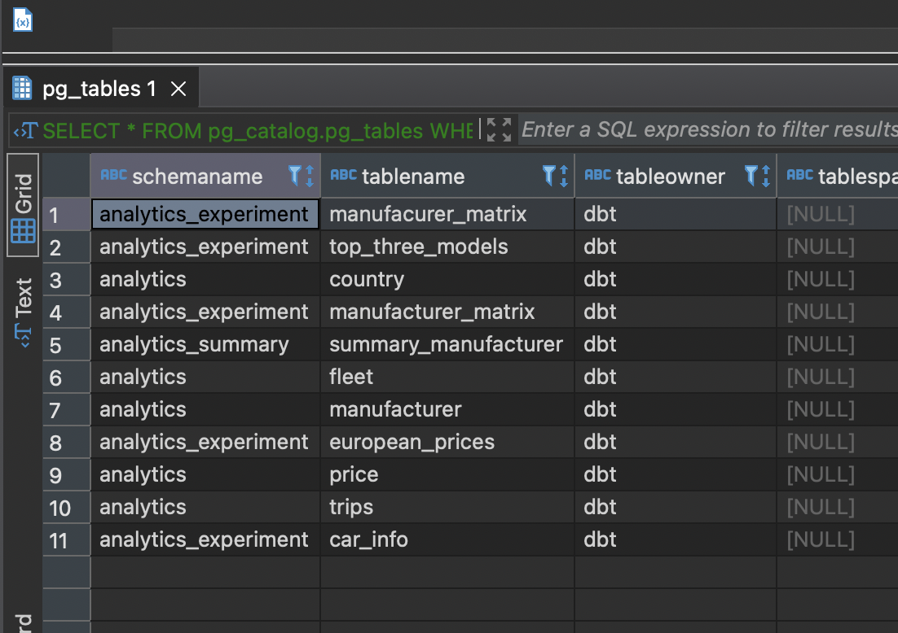
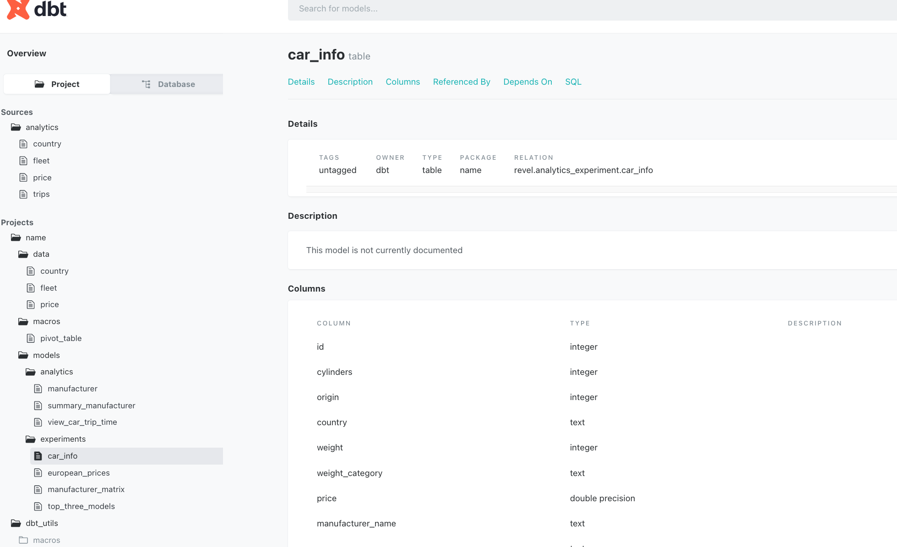

## REVEL TEST
I have done this test using docker, python and dbt. 
All development has been dockerised in a docker compose containing two services `postgres` (the database) and `dbt` (the data model).
If you want to run the code clone the repository and in the same directory run:
````
docker-compose up --build --remove-orphans
````
Then after waiting about three minutes you will be able to connect to a postgres database with the following credentials:
````
host: localhost
user: dbt
password: dbtpassword
database: revel
port: 5432
````
Or you can also watch the project documentation at [http://localhost:8080/](http://localhost:8080/). 

In the database you can access:
* Schema `analytics` fo (`contry`, `fleet`, `price`, `trips`) and also the  `manufacturer` with information of the manufacturer of each car 
* Schema `analytics_summary`  with the table `summary_manufacturer` that containts information of the second question (Number of trips done by car manufacturer,  Total distance travelled and average trip distance travelled by car manufacturer, Average trip duration in minutes by car manufacturer). 
* Schema `analytics_experiment` with the table `top_three_models` (info of the top three car model per manufacturer), `car_info` which are auxiliar tables for `european_prices` (minimum, average and maximum car price for each European manufacturer and # of cylinders) and `manufacturer_matrix` (km per manufacturer and weight group)

## Tables


## Functionality: 
We can see the steps followed by the dbt service in the makefile file, as it contains a set of nested commands that allow to generate the whole DBMS. These are the steps:
1. `clean`. Execute `python clean_schema.py` to remove the schema `analytics` if it was there and create a clean one. 
2. `debub`. Execute `dbt debug` as a fail fast execution that check that all the dbt files and folders are there. 
3. `deps`. Execute `dbt deps` to install dbt packages (we have user dbt-utils)
4. `seed`. Execute `dbt seed` to upload the csv in data folder (country, fleet and price) and create a table per csv. (Trips are not there because its too heave )
5. `ingest`.  Execute `python ingest_trips.py` that create a table for trips.csv becase it has 1_510_723 rows and is too heavy for dbt seed, actually we have use [dask.dataframe](https://docs.dask.org/en/stable/dataframe.html) to scale up the ingestion. 
6. `analytics`. Exeucte `dbt run --select tag:analytics` that run analytics models.
7. `experiment`. Exeucte `dbt run --select tag:experiment` that run experiment models.
8. `matrix`. Exeucte `dbt run --select tag:matrix` that run the manufacturer matrix.
9.  `docs`. Execute `dbt docs generate` to generate the auto documentation
10. `serve`. Execute `dbt docs servve` to serve the documentation at 8080.

## Restrictions
Trips data has been uploaded in feather format in order to avoid Github limit. 


## Documentation

Once the whole process is finished you can access [http://localhost:8080/](http://localhost:8080/). 
